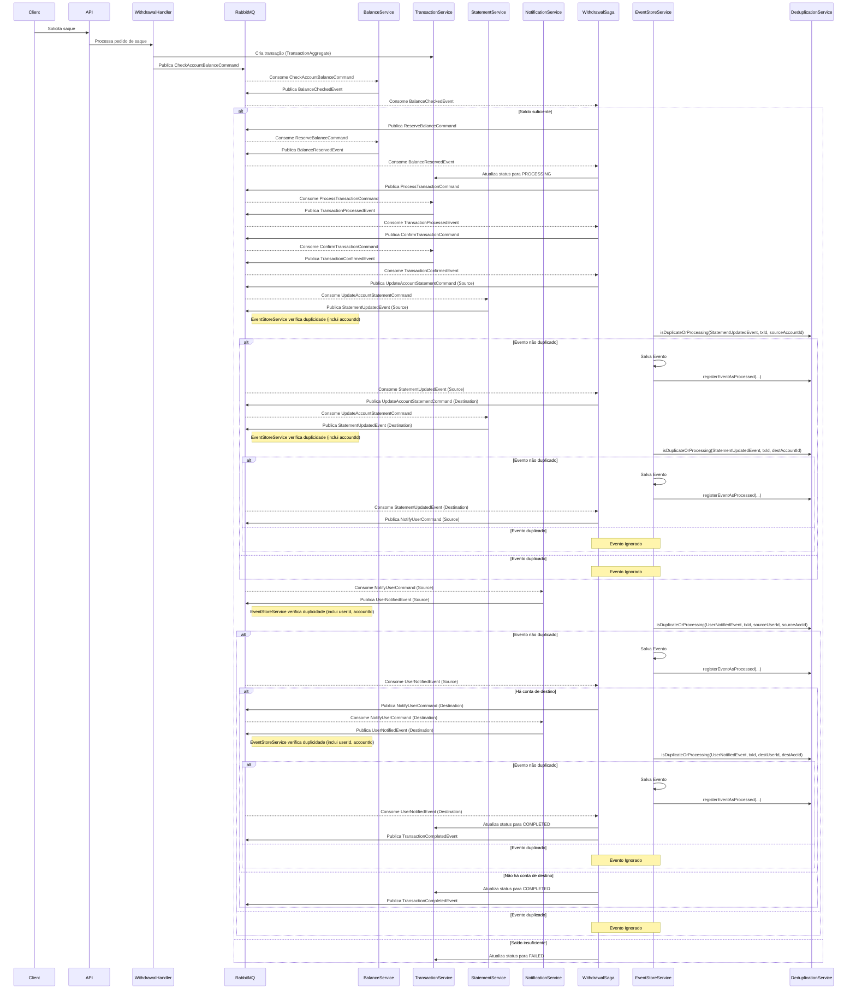
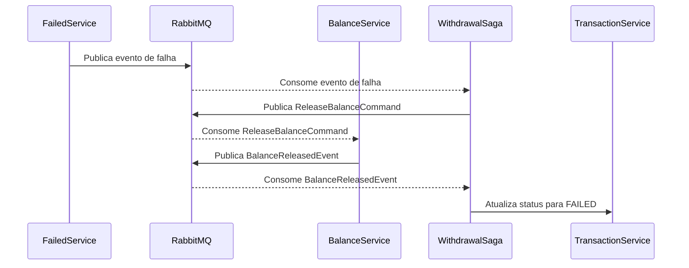

# Fluxo de Saque (Withdrawal) com RabbitMQ

Este documento descreve o fluxo de uma operação de saque (withdrawal) no sistema após a migração para filas RabbitMQ.

## Diagrama do Fluxo

## Descrição do Fluxo

1. **Início da Transação**:

   - O cliente solicita um saque através da API
   - O WithdrawalHandler cria uma transação de saque via TransactionAggregate
   - Publica o comando CheckAccountBalanceCommand para a fila RabbitMQ

2. **Verificação de Saldo**:

   - O BalanceService consome o comando e verifica se há saldo suficiente
   - Publica o evento BalanceCheckedEvent com o resultado

3. **Fluxo para Saldo Suficiente**:

   - WithdrawalSaga processa o evento BalanceCheckedEvent
   - Se houver saldo, publica o comando ReserveBalanceCommand
   - O BalanceService reserva o saldo e publica BalanceReservedEvent
   - WithdrawalSaga atualiza o status da transação para PROCESSING
   - Publica o comando ProcessTransactionCommand

4. **Processamento e Confirmação**:

   - TransactionService processa e publica TransactionProcessedEvent
   - WithdrawalSaga publica ConfirmTransactionCommand
   - TransactionService confirma e publica TransactionConfirmedEvent

5. **Atualização de Extrato**:

   - WithdrawalSaga publica UpdateAccountStatementCommand
   - StatementService atualiza o extrato e publica StatementUpdatedEvent

6. **Notificação ao Usuário**:

   - WithdrawalSaga publica NotifyUserCommand
   - NotificationService notifica o usuário e publica UserNotifiedEvent
   - WithdrawalSaga finaliza a transação como COMPLETED

7. **Fluxo para Saldo Insuficiente**:
   - Se não houver saldo, a transação é marcada como FAILED

## Compensação em Caso de Falha

Se ocorrer uma falha em qualquer etapa após a reserva do saldo, o sistema executa um processo de compensação:

Este fluxo assegura que, mesmo em caso de falhas, o sistema mantenha a consistência e evite problemas como perda de saldo ou transações em estado inconsistente.
